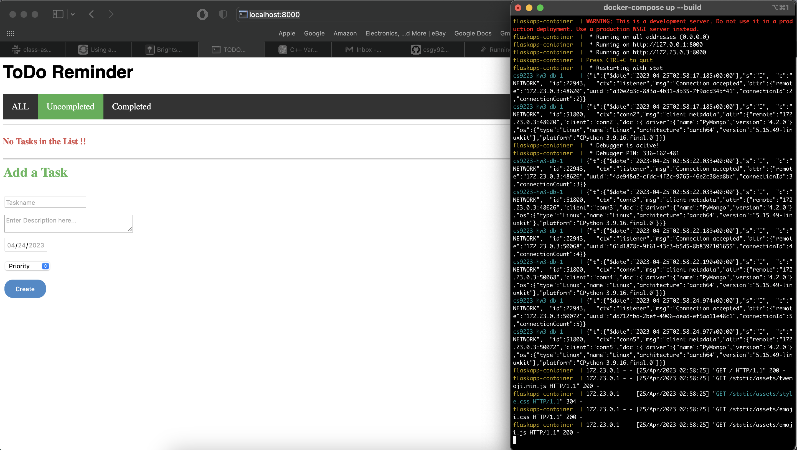

# CSGY 9223 Cloud Computing HW3

### Part 2 - Docker Containerization

To test with docker compose, run:  
`docker-compose up --build`  

You can see the application run locally here:

### Part 3 - Deploying on Minikube

`kubectl create -f <yaml_file>`  
`kubectl apply -f <yaml_file>`  
`kubectl delete service <name>`  
`kubectl delete deployment <name>`  

### Part 5 - Replication Controller

### Part 6 - Rolling Update

### Part 7 - Health Monitoring